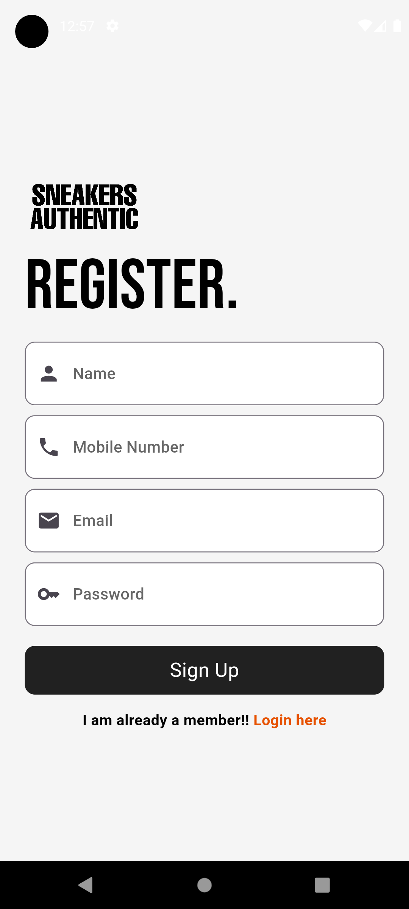

# 👟 SneakersAuthentic 🛍️

<div style="background-color: white; display: inline-block; padding: 10px;">
  
</div>

## 🌟 Description

SneakersAuthentic is a cutting-edge sneaker shopping app developed as part of an educational project. This application aims to provide sneakerheads with a seamless and intuitive platform for browsing and purchasing authentic kicks. With a focus on user experience, SneakersAuthentic features a sleek design and easy navigation, allowing enthusiasts to explore a wide variety of styles and brands.

## 📋 Table of Contents

- [Installation](#-installation)
- [Features](#-features)
- [Usage](#-usage)
- [In-App Pictures](#-in-app-pictures)
- [Tech Stack](#-tech-stack)
- [Contributing](#-contributing)
- [License](#-license)

## 🚀 Installation

To set up SneakersAuthentic on your local machine, follow these steps:

1. Ensure you have Flutter installed on your system. If not, follow the [official Flutter installation guide](https://flutter.dev/docs/get-started/install).

2. Clone the repository:

   ```
   git clone https://github.com/bugmarkey/SneakersAuthentic-Shopping-App.git
   ```

3. Navigate to the project directory:

   ```
   cd SneakersAuthentic-Shopping-App
   ```

4. Install dependencies:

   ```
   flutter pub get
   ```

5. Run the app:
   ```
   flutter run
   ```

## ✨ Features

SneakersAuthentic demonstrates the following features:

- 🔐 User authentication and account management
- 📚 Product listing and detail views
- 🛒 Shopping cart functionality
- 💳 Checkout process simulation
- 🔍 Search and filter capabilities
- 📱 Responsive UI design
- 🧠 State management implementation
- 🔥 Integration with Firebase services

## 🖥️ Usage

1. Launch the app on your emulator or physical device.
2. Create an account or log in to your existing account.
3. Browse the sneaker catalog with different filters.
4. Explore detailed views of each sneaker, including descriptions, size charts, and add-to-cart options.
5. Visit the cart page to adjust quantities and proceed to checkout.
6. Use the sidebar for category navigation and logout features.

## 📸 In-App Pictures

<div align="center">
  
  
  
  
  
  
  
</div>

## 🛠️ Tech Stack

SneakersAuthentic is built using the following technologies:

- 
- 

## 🤝 Contributing

We welcome contributions to SneakersAuthentic! If you'd like to contribute, please follow these steps:

1. Fork the repository
2. Create your feature branch (`git checkout -b feature/AmazingFeature`)
3. Commit your changes (`git commit -m 'Add some AmazingFeature'`)
4. Push to the branch (`git push origin feature/AmazingFeature`)
5. Open a Pull Request

## 📄 License

This project is licensed under the MIT License - see the [LICENSE](LICENSE) file for details.

---

<div align="center">

Made with ❤️ by the SneakersAuthentic Team

[](https://github.com/bugmarkey/SneakersAuthentic-Shopping-App)
[](https://github.com/bugmarkey/SneakersAuthentic-Shopping-App/fork)

</div>
